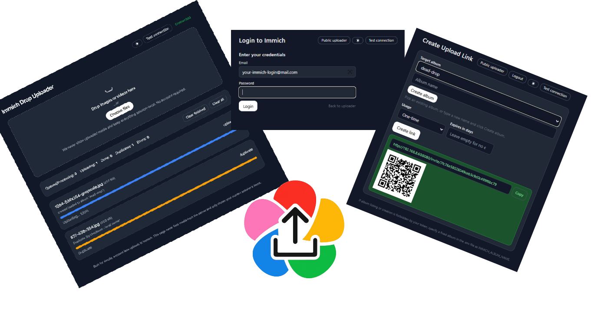

# Immich Drop Uploader

A tiny web app for collecting photos/videos into your **Immich** server.
Admin users log in to create public invite links; invite links are always public-by-URL. A public uploader page is optional and disabled by default.



## Features

- **Invite links (public)** — create upload links you can share with anyone  
- **One‑time link claim** — first browser session claims a one‑time link; it can upload multiple files, others are blocked  
- **Optional public uploader** — disabled by default; can be enabled via `.env`  
- **Queue with progress** via WebSocket (success / duplicate / error)  
- **Duplicate prevention** (local SHA‑1 cache + optional Immich bulk‑check)  
- **Original dates preserved** (EXIF → `fileCreatedAt` / `fileModifiedAt`)  
- **Mobile‑friendly**  
- **.env‑only config** (clean deploys) + Docker/Compose  
- **Privacy‑first**: never lists server media; UI only shows the current session  
- **Dark mode** — detects system preference; manual toggle persists across pages  
- **Albums** — add uploads to a configured album (creates if needed)  
- **Copy + QR** — copy invite link and display QR for easy sharing

---

## Table of contents
- [Quick start](#quick-start)
- [New Features](#new-features)
- [Architecture](#architecture)
- [Folder structure](#folder-structure)
- [Requirements](#requirements)
- [Configuration (.env)](#configuration-env)
- [How it works](#how-it-works)
- [Mobile notes](#mobile-notes)
- [Troubleshooting](#troubleshooting)
- [Security notes](#security-notes)
- [Development](#development)
- [License](#license)

---
## Quick start
You can run without a `.env` file by putting all settings in `docker-compose.yml` (recommended for deploys).
Use a `.env` file only for local development.

### docker-compose.yml (deploy without .env)
```yaml
version: "3.9"

services:
  immich-drop:
    image: ghcr.io/nasogaa/immich-drop:latest
    pull_policy: always
    container_name: immich-drop
    restart: unless-stopped

    # Configure all settings here (no .env required)
    environment:

      # Immich connection (must include /api)
      IMMICH_BASE_URL: https://immich.example.com/api
      IMMICH_API_KEY: ${IMMICH_API_KEY}

      # Optional behavior
      IMMICH_ALBUM_NAME: dead-drop
      PUBLIC_UPLOAD_PAGE_ENABLED: "false"   # keep disabled by default
      PUBLIC_BASE_URL: https://drop.example.com

      # App internals
      SESSION_SECRET: ${SESSION_SECRET}

    # Expose the app on the host
    ports:
      - 8080:8080

    # Persist local dedupe cache (state.db) across restarts
    volumes:
      - immich_drop_data:/data

    # Simple healthcheck
    healthcheck:
      test: ["CMD-SHELL", "python - <<'PY'\nimport os,urllib.request,sys; url=f\"http://127.0.0.1:{os.getenv('PORT','8080')}/\";\ntry: urllib.request.urlopen(url, timeout=3); sys.exit(0)\nexcept Exception: sys.exit(1)\nPY"]
      interval: 30s
      timeout: 5s
      retries: 3
      start_period: 10s

volumes:
  immich_drop_data:
```

```
### CLI
```bash
docker compose pull
docker compose up -d
```
---

## New Features

### 🔐 Login + Menu
- Login with your Immich credentials to access the menu.
- The menu lets you list/create albums and create invite links.
- The menu is always behind login; logout clears the session.

### 🔗 Invite Links
- Links are always public by URL (no login required to use).
- You can make links one‑time (claimed by the first browser session) or indefinite / limited uses.
- Set link expiry (e.g., 1, 2, 7 days). Expired links are inactive.
- Copy link and view a QR code for easy sharing.

### 🌙 Dark Mode
- Automatically detects system dark/light preference on first visit
- Manual toggle button in the header (sun/moon icon)
- Preference saved in browser localStorage
- Smooth color transitions for better UX
- All UI elements properly themed for both modes

### 📁 Album Integration
- Configure `IMMICH_ALBUM_NAME` environment variable to auto-add uploads to a specific album
- Album is automatically created if it doesn't exist
- Efficient caching of album ID to minimize API calls
- Visual feedback showing which album uploads are being added to
- Works seamlessly with existing duplicate detection

### 🐛 Bug Fixes
- Fixed WebSocket disconnection error that occurred when clients closed connections
- Improved error handling for edge cases

---

## Architecture

- **Frontend:** static HTML/JS (Tailwind). Drag & drop or "Choose files", queue UI with progress and status chips.  
- **Backend:** FastAPI + Uvicorn.  
  - Proxies uploads to Immich `/assets`  
  - Computes SHA‑1 and checks a local SQLite cache (`state.db`)  
  - Optional Immich de‑dupe via `/assets/bulk-upload-check`  
  - WebSocket `/ws` pushes per‑item progress to the current browser session only  
- **Persistence:** local SQLite (`state.db`) prevents re‑uploads across sessions/runs.

---

## Folder structure

```
immich_drop/
├─ app/                     # FastAPI application (Python package)
│  ├─ app.py                # ASGI app (uvicorn entry: app.app:app)
│  └─ config.py             # Settings loader (reads .env/env)
├─ frontend/                # Static UI (served at /static)
│  ├─ index.html            # Public uploader (optional)
│  ├─ login.html            # Login page (admin)
│  ├─ menu.html             # Admin menu (create invites)
│  ├─ invite.html           # Public invite upload page
│  ├─ app.js                # Uploader logic (drop/queue/upload/ws)
│  ├─ header.js             # Shared header (theme + ping + banner)
│  └─ favicon.png           # Tab icon (optional)
├─ data/                    # Local dev data dir (bind to /data in Docker)
├─ main.py                  # Thin dev entrypoint (python main.py)
├─ requirements.txt         # Python dependencies
├─ Dockerfile
├─ docker-compose.yml
├─ .env.example             # Example dev environment (optional)
├─ README.md
└─ screenshot.png           # UI screenshot for README
```

---

## Requirements

- **Python** 3.11
- An **Immich** server + **API key**

---
# Local dev quickstart

## Development

Run with live reload:

```bash
python main.py
```

The backend contains docstrings so you can generate docs later if desired.

---

## Dev Configuration (.env)

```ini
# Server (dev only)
HOST=0.0.0.0
PORT=8080

# Immich connection (include /api)
IMMICH_BASE_URL=http://REPLACE_ME:2283/api
IMMICH_API_KEY=ADD-YOUR-API-KEY   # needs: asset.upload; for albums also: album.create, album.read, albumAsset.create
MAX_CONCURRENT=3

# Public uploader page (optional) — disabled by default
PUBLIC_UPLOAD_PAGE_ENABLED=TRUE

# Album (optional): auto-add uploads from public uploader to this album (creates if needed)
IMMICH_ALBUM_NAME=dead-drop

# Local dedupe cache (SQLite)
STATE_DB=./data/state.db

# Base URL for generating absolute invite links (recommended for production)
# e.g., PUBLIC_BASE_URL=https://photos.example.com
#PUBLIC_BASE_URL=

# Session and security
SESSION_SECRET=SET-A-STRONG-RANDOM-VALUE
LOG_LEVEL=DEBUG

```


You can keep a checked‑in `/.env.example` with the keys above for onboarding.

---

## How it works

1. **Queue** – Files selected in the browser are queued; each gets a client‑side ID.  
2. **De‑dupe (local)** – Server computes **SHA‑1** and checks `state.db`. If seen, marks as **duplicate**.  
3. **De‑dupe (server)** – Attempts Immich `/assets/bulk-upload-check`; if Immich reports duplicate, marks accordingly.  
4. **Upload** – Multipart POST to `${IMMICH_BASE_URL}/assets` with:
   - `assetData`, `deviceAssetId`, `deviceId`,  
   - `fileCreatedAt`, `fileModifiedAt` (from EXIF when available; else `lastModified`),  
   - `isFavorite=false`, `filename`, and header `x-immich-checksum`.  
5. **Album** – If `IMMICH_ALBUM_NAME` is configured, adds the uploaded asset to the album (creates album if it doesn't exist).  
6. **Progress** – Backend streams progress via WebSocket to the same session.  
7. **Privacy** – UI shows only the current session's items. It never lists server media.

---

## Security notes

- The menu and invite creation are behind login. Logout clears the session.  
- Invite links are public by URL; share only with intended recipients.  
- The default uploader page at `/` is disabled unless `PUBLIC_UPLOAD_PAGE_ENABLED=true`.  
- The Immich API key remains **server‑side**; the browser never sees it.  
- No browsing of uploaded media; only ephemeral session state is shown.  
- Run behind HTTPS with a reverse proxy and restrict CORS to your domain(s).

## Usage flow

- Admin: Login → Menu → Create invite link (optionally one‑time / expiry / album) → Share link or QR.  
- Guest: Open invite link → Drop files → Upload progress and results shown.  
- Optional: Enable public uploader and set `IMMICH_ALBUM_NAME` for a default landing page.

---

## License

MIT.
