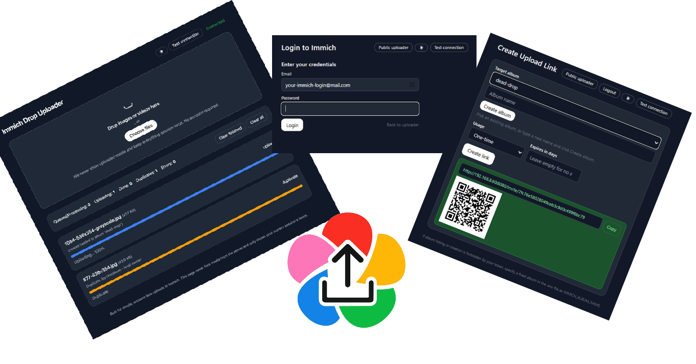

# Immich Drop Uploader

A tiny web app for collecting photos/videos into your **Immich** server.
Admin users log in to create public invite links; invite links are always public-by-URL. A public uploader page is optional and disabled by default.



## Features

- **Invite Links:** public-by-URL links for uploads; one-time or multi-use
- **Manage Links:** search/sort, enable/disable, delete, edit name/expiry
- **Row Actions:** icon-only actions with tooltips (Open, Copy, Details, QR, Save)
- **Passwords (optional):** protect invites with a password gate
- **Albums (optional):** upload into a specific album (auto-create supported)
- **Duplicate Prevention:** local SHA‑1 cache (+ optional Immich bulk-check)
- **Progress Queue:** WebSocket updates; retry failed items
- **Chunked Uploads (optional):** large-file support with configurable chunk size
- **Privacy-first:** never lists server media; session-local uploads only
- **Mobile + Dark Mode:** responsive UI, safe-area padding, persistent theme
- **URL Downloads:** download from TikTok, Instagram, Facebook, Reddit, YouTube, Twitter, Flickr, Imgur, Tumblr, Pinterest, and many more -- upload to Immich
- **Platform Cookies:** add authentication cookies for platforms requiring login (Instagram, TikTok, etc.)
- **iOS Shortcut:** share social media URLs from your iPhone to Immich ([setup guide](docs/ios-shortcuts.md))

---

## Table of contents
- [Quick start](#quick-start)
- [iOS Shortcuts](#ios-shortcuts)
- [URL Downloads](#url-downloads)
- [Platform Cookies](#platform-cookies)
- [New Features](#new-features)
- [Chunked Uploads](#chunked-uploads)
- [Architecture](#architecture)
- [Folder structure](#folder-structure)
- [Requirements](#requirements)
- [Configuration (.env)](#configuration-env)
- [How it works](#how-it-works)
- [Mobile notes](#mobile-notes)
- [Troubleshooting](#troubleshooting)
- [Security notes](#security-notes)
- [Development](#development)
- [License](#license)

---
## Quick start
You can run without a `.env` file by putting all settings in `docker-compose.yml` (recommended for deploys).
Use a `.env` file only for local development.

### docker-compose.yml (deploy without .env)
```yaml
version: "3.9"

services:
  immich-drop:
    image: ttlequas0/immich-drop:latest
    pull_policy: always
    container_name: immich-drop
    restart: unless-stopped

    # Configure all settings here (no .env required)
    environment:

      # Immich connection (must include /api)
      IMMICH_BASE_URL: https://immich.example.com/api
      IMMICH_API_KEY: ${IMMICH_API_KEY}

      # Optional behavior
      IMMICH_ALBUM_NAME: dead-drop
      PUBLIC_UPLOAD_PAGE_ENABLED: "false"   # keep disabled by default
      PUBLIC_BASE_URL: https://drop.example.com

      # Large files: chunked uploads (bypass 100MB proxy limits)
      CHUNKED_UPLOADS_ENABLED: "false"      # enable chunked uploads
      CHUNK_SIZE_MB: "95"                  # per-chunk size (MB)

      # App internals
      SESSION_SECRET: ${SESSION_SECRET}

    # Expose the app on the host
    ports:
      - 8080:8080

    # Persist local dedupe cache (state.db) across restarts
    volumes:
      - immich_drop_data:/data

    # Simple healthcheck
    healthcheck:
      test: ["CMD-SHELL", "python - <<'PY'\nimport os,urllib.request,sys; url=f\"http://127.0.0.1:{os.getenv('PORT','8080')}/\";\ntry: urllib.request.urlopen(url, timeout=3); sys.exit(0)\nexcept Exception: sys.exit(1)\nPY"]
      interval: 30s
      timeout: 5s
      retries: 3
      start_period: 10s

volumes:
  immich_drop_data:
```

```
### CLI
```bash
docker compose pull
docker compose up -d
```
---

## iOS Shortcut

Share a social media link from any app on your iPhone and upload it to Immich.

Works with TikTok, Instagram, Facebook, Reddit, YouTube, Twitter/X, and more. Uses async polling so it won't time out on slow downloads.

**[Setup guide and download](docs/ios-shortcuts.md)**

---

## URL Downloads

Upload content from social media platforms directly via the web UI or API:

**Supported Platforms:**
- TikTok
- Instagram (Reels, Posts, Stories)
- Facebook (Reels, Videos)
- Reddit (videos, images, galleries)
- YouTube (Shorts, videos)
- Twitter/X
- Flickr
- Imgur (images, albums)
- Tumblr
- Pinterest
- ArtStation
- DeviantArt
- Pixiv
- Danbooru
- Bluesky
- And many more via [gallery-dl](https://github.com/mikf/gallery-dl)

**API Endpoints:**
| Endpoint | Method | Purpose |
|----------|--------|---------|
| `/api/upload/base64` | POST | Upload base64-encoded file (best for iOS Shortcuts) |
| `/api/upload/url` | POST | Download and upload from single URL |
| `/api/upload/urls` | POST | Batch URL downloads (max 10) |
| `/api/supported-platforms` | GET | List supported platforms |

---

## Platform Cookies

Many social media platforms require authentication to access certain content (e.g., Instagram Reels, private TikTok videos). You can configure cookies in the admin panel to enable authenticated downloads.

**Setup:**
1. Log in to the admin menu (`/menu`)
2. Scroll to "Platform Cookies" section
3. Select platform (Instagram, TikTok, Twitter, Reddit, YouTube)
4. Paste your cookie string from browser DevTools
5. Click "Save Cookie"

**Getting cookies from your browser:**
1. Open the platform in your browser (logged in)
2. Open DevTools (F12) > Network tab
3. Refresh the page and click any request to the platform
4. Find "Cookie:" in Request Headers
5. Copy the entire value

**Cookie API Endpoints:**
| Endpoint | Method | Purpose |
|----------|--------|---------|
| `/api/cookies` | GET | List configured platform cookies |
| `/api/cookies` | POST | Create or update platform cookie |
| `/api/cookies/{platform}` | DELETE | Delete platform cookie |

Cookies are stored server-side in `/data/cookies/` and automatically used when downloading from the corresponding platform.

---

## What's New

### v0.5.0 – Manage Links overhaul
- In-panel bulk actions footer (Delete/Enable/Disable stay inside the box)
- Per-row icon actions with tooltips; Save button lights up only on changes
- Per-row QR modal; Details modal close fixed and reliable
- Auto-refresh after creating a link; new row is highlighted and scrolled into view
- Expiry save fix: stores end-of-day to avoid off-by-one date issues

Roadmap: per-user auth with individual Immich API tokens (not in scope yet).

### Responsive UI
- Responsive layout for small and large screens
- Mobile-safe file picker with a sticky “Choose files” bar
- Safe-area padding for notched devices; dark/light theme toggle
- Desktop keeps the dropzone clickable; touch devices avoid accidental double-open

### Reliability
- Retry button for failed uploads without re-selecting the file
- Progress updates handle late/reordered WebSocket events
- Invites can be created without an album

### Dark mode
- Automatic or manual toggle; persisted preference

### Album integration
- Auto-create + assign album if configured; optional invites without album

---

## Chunked Uploads

- Enable chunked uploads by setting `CHUNKED_UPLOADS_ENABLED=true`.
- Configure chunk size with `CHUNK_SIZE_MB` (default: `95`). The client only uses chunked mode for files larger than this.
- Intended to bypass upstream limits (e.g., 100MB) while preserving duplicate checks, EXIF timestamps, album add, and per‑item progress via WebSocket.

---

## Architecture

- **Frontend:** static HTML/JS. Drag & drop or "Choose files", queue UI with progress and status chips.  
- **Backend:** FastAPI + Uvicorn.  
  - Proxies uploads to Immich `/assets`  
  - Computes SHA-1 and checks a local SQLite cache (`state.db`)  
  - Optional Immich de-dupe via `/assets/bulk-upload-check`  
  - URL downloads use gallery-dl (images/galleries) with yt-dlp fallback (videos)  
  - WebSocket `/ws` pushes per-item progress to the current browser session only  
- **Persistence:** local SQLite (`state.db`) prevents re-uploads across sessions/runs.

---

## Folder structure

```
immich_drop/
├─ app/                     # FastAPI application (Python package)
│  ├─ app.py                # ASGI app (uvicorn entry: app.app:app)
│  ├─ api_routes.py         # URL download and iOS Shortcut endpoints
│  ├─ url_downloader.py     # gallery-dl + yt-dlp media extraction pipeline
│  ├─ cookie_manager.py     # Platform cookie storage and Netscape format conversion
│  └─ config.py             # Settings loader (reads .env/env)
├─ frontend/                # Static UI (served at /static)
│  ├─ index.html            # Public uploader (optional)
│  ├─ login.html            # Login page (admin)
│  ├─ menu.html             # Admin menu (create invites)
│  ├─ invite.html           # Public invite upload page
│  ├─ app.js                # Uploader logic (drop/queue/upload/ws)
│  ├─ url-uploader.js       # URL upload UI component
│  ├─ header.js             # Shared header (theme + ping + banner)
│  └─ favicon.png           # Tab icon (optional)
├─ docs/                    # Documentation
│  └─ ios-shortcuts.md      # iOS Shortcuts setup guide
├─ data/                    # Local dev data dir (bind to /data in Docker)
├─ main.py                  # Thin dev entrypoint (python main.py)
├─ requirements.txt         # Python dependencies
├─ Dockerfile
├─ docker-compose.yml
├─ .env.example             # Example dev environment (optional)
├─ README.md
└─ screenshot.png           # UI screenshot for README
```

---

## Requirements

- **Python** 3.11
- An **Immich** server + **API key**
- **gallery-dl** and **yt-dlp** (installed automatically in Docker image)

---
# Local dev quickstart

## Development

Run with live reload:

```bash
python main.py
```

The backend contains docstrings so you can generate docs later if desired.

---

## Dev Configuration (.env)

```ini
# Server (dev only)
HOST=0.0.0.0
PORT=8080

# Immich connection (include /api)
IMMICH_BASE_URL=http://REPLACE_ME:2283/api
IMMICH_API_KEY=ADD-YOUR-API-KEY   # needs: asset.upload; for albums also: album.create, album.read, albumAsset.create
MAX_CONCURRENT=3

# Public uploader page (optional) -- disabled by default
PUBLIC_UPLOAD_PAGE_ENABLED=TRUE

# Album (optional): auto-add uploads from public uploader to this album (creates if needed)
IMMICH_ALBUM_NAME=dead-drop

# Local dedupe cache (SQLite)
STATE_DB=./data/state.db

# Base URL for generating absolute invite links (recommended for production)
# e.g., PUBLIC_BASE_URL=https://photos.example.com
#PUBLIC_BASE_URL=

# Session and security
SESSION_SECRET=SET-A-STRONG-RANDOM-VALUE
LOG_LEVEL=DEBUG

# Chunked uploads (optional)
CHUNKED_UPLOADS_ENABLED=true
CHUNK_SIZE_MB=95

```


You can keep a checked‑in `/.env.example` with the keys above for onboarding.

---

## How it works

1. **Queue** – Files selected in the browser are queued; each gets a client‑side ID.  
2. **De‑dupe (local)** – Server computes **SHA‑1** and checks `state.db`. If seen, marks as **duplicate**.  
3. **De‑dupe (server)** – Attempts Immich `/assets/bulk-upload-check`; if Immich reports duplicate, marks accordingly.  
4. **Upload** – Multipart POST to `${IMMICH_BASE_URL}/assets` with:
   - `assetData`, `deviceAssetId`, `deviceId`,  
   - `fileCreatedAt`, `fileModifiedAt` (from EXIF when available; else `lastModified`),  
   - `isFavorite=false`, `filename`, and header `x-immich-checksum`.  
5. **Album** – If `IMMICH_ALBUM_NAME` is configured, adds the uploaded asset to the album (creates album if it doesn't exist).  
6. **Progress** – Backend streams progress via WebSocket to the same session.  
7. **Privacy** – UI shows only the current session's items. It never lists server media.

---

## Security notes

- The menu and invite creation are behind login. Logout clears the session.  
- Invite links are public by URL; share only with intended recipients.  
- The default uploader page at `/` is disabled unless `PUBLIC_UPLOAD_PAGE_ENABLED=true`.  
- The Immich API key remains **server‑side**; the browser never sees it.  
- No browsing of uploaded media; only ephemeral session state is shown.  
- Run behind HTTPS with a reverse proxy and restrict CORS to your domain(s).

## Usage flow

- Admin: Login → Menu → Create invite link (optionally one‑time / expiry / album) → Share link or QR.  
- Guest: Open invite link → Drop files → Upload progress and results shown.  
- Optional: Enable public uploader and set `IMMICH_ALBUM_NAME` for a default landing page.

---

## License

MIT.
